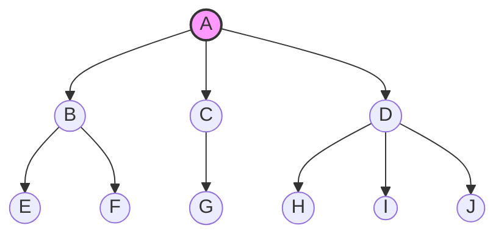
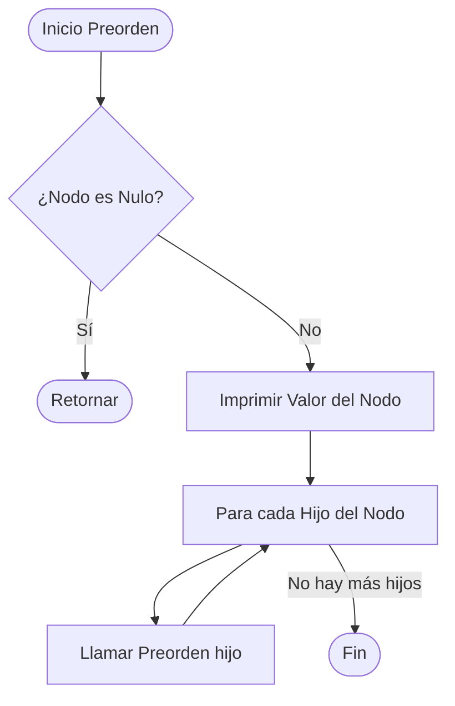

Aquí tienes un archivo `README.md` completo y estructurado para tu proyecto de GitHub, integrando diagramas en formato Mermaid (que GitHub renderiza nativamente) para que sea visual y fácil de entender.

***

# Árbol Multicamino en Java

Este proyecto implementa una estructura de datos de **Árbol Multicamino** (o Árbol N-ario) en Java. A diferencia de un árbol binario, cada nodo en este tipo de árbol puede tener un número ilimitado de hijos, lo que lo hace ideal para representar jerarquías complejas como sistemas de archivos o estructuras organizacionales.

## Estructura del Árbol

El código de ejemplo en `EjemploArbolMulticamino.java` construye la siguiente jerarquía visual:



## Funcionamiento del Código

El sistema se divide en tres componentes principales:
1.  **Clase `Nodo`**: Contiene el valor (`String`) y una lista dinámica (`List<Nodo>`) para almacenar a sus hijos.
2.  **Clase `ArbolMulticamino`**: Gestiona la raíz y contiene los algoritmos de búsqueda y recorrido.
3.  **Algoritmos de Recorrido**:
    * **Preorden**: Raíz → Hijos.
    * **Postorden**: Hijos → Raíz.
    * **Por Niveles (BFS)**: Visita el árbol nivel por nivel usando una cola.

### Diagrama de Flujo: Recorrido Preorden
Este diagrama representa la lógica recursiva utilizada para visitar los nodos:



## Cómo ejecutarlo

1.  Asegúrate de tener instalado el **JDK 8** o superior.
2.  Copia el código en un archivo llamado `EjemploArbolMulticamino.java`.
3.  Compila y ejecuta desde la terminal:

```bash
javac EjemploArbolMulticamino.java
java EjemploArbolMulticamino
```

## 🔍 Métodos Incluidos

| Método | Descripción |
| :--- | :--- |
| `preorden(Nodo n)` | Recorrido recursivo priorizando la raíz actual. |
| `postorden(Nodo n)` | Recorrido recursivo priorizando los descendientes. |
| `recorridoPorNiveles()` | Implementación iterativa mediante una cola (`Queue`). |
| `buscar(Nodo n, String v)` | Búsqueda booleana exhaustiva en toda la estructura. |

---

Para ayudarte a visualizar cómo funcionan realmente estos recorridos y la estructura del árbol de forma dinámica, he preparado una herramienta interactiva a continuación.

```json?chameleon
{"component":"LlmGeneratedComponent","props":{"height":"700px","prompt":"Crea una herramienta interactiva para visualizar un Árbol Multicamino basado en el código Java proporcionado. \n\n1. Objetivo: Permitir al usuario explorar visualmente el árbol A -> (B,C,D), B->(E,F), C->(G), D->(H,I,J) y ver cómo funcionan los recorridos.\n2. Visualización: Dibuja el árbol de forma jerárquica clara. Los nodos deben ser círculos con su letra correspondiente.\n3. Controles: \n   - Botón 'Preorden': Animar los nodos uno a uno en el orden A, B, E, F, C, G, D, H, I, J.\n   - Botón 'Postorden': Animar los nodos en orden E, F, B, G, C, H, I, J, D, A.\n   - Botón 'Por Niveles (BFS)': Animar los nodos en orden A, B, C, D, E, F, G, H, I, J.\n   - Botón 'Reset': Detener animaciones y volver al estado inicial.\n4. Comportamiento: Al animar, el nodo actual debe resaltarse visualmente. Mostrar debajo del árbol una lista de 'Nodos visitados' que se actualice en tiempo real durante la animación.\n5. Estética: Limpia y académica. Usa una disposición vertical para el árbol. No uses colores específicos, solo indica 'resaltado' para el nodo activo.","id":"im_bbddaa1cf38675cd"}}
```
